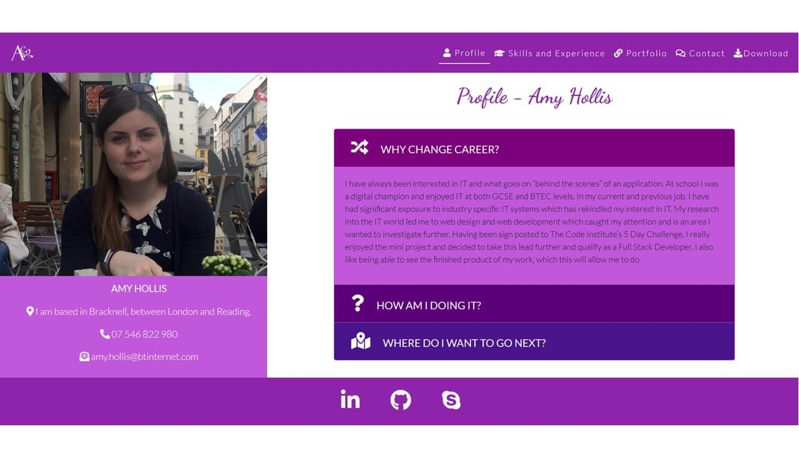
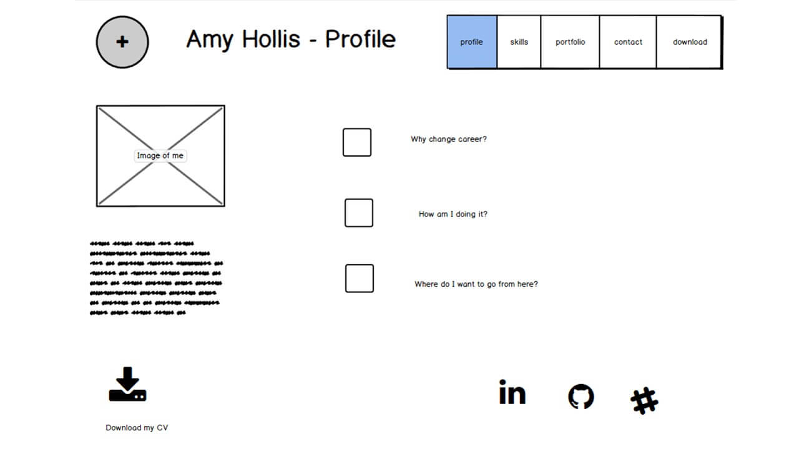
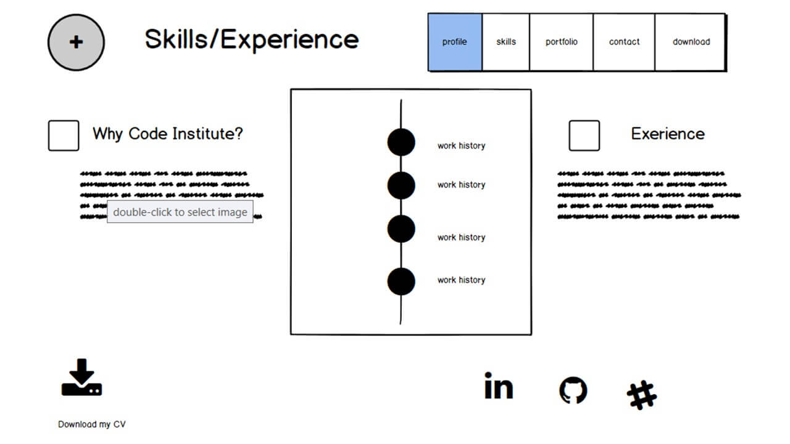
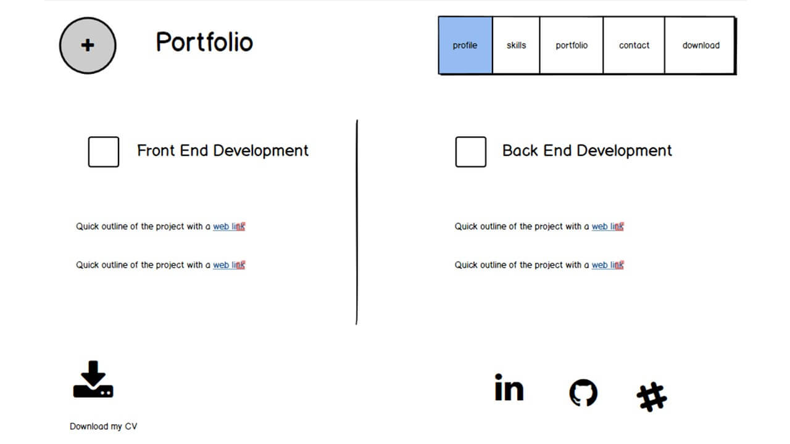
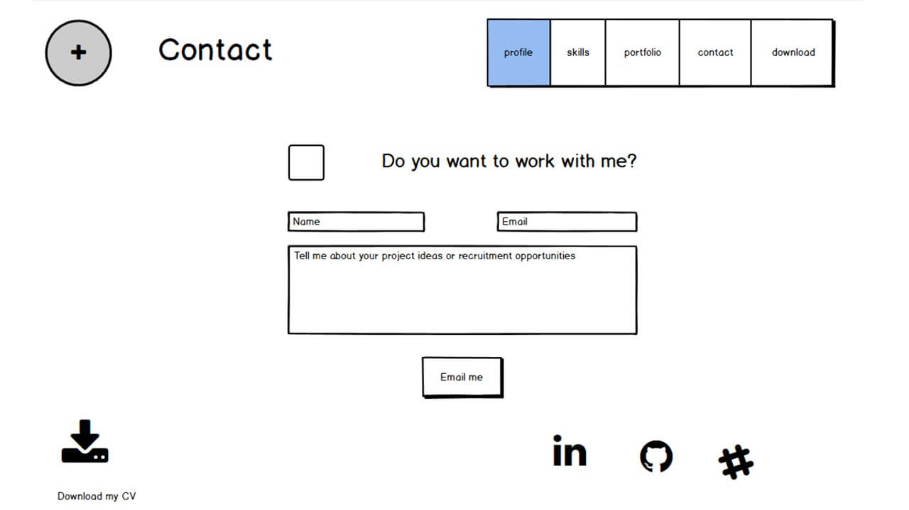

# User Centric Front-End Development Milestone Project - Portfolio

## [Portfolio Project](https://amyh97.github.io/milestone-project-1/)



This website is for me as a web developer. The website features a breakdown of my skills and experience, links to other projects that I have done and a contact page. The main goal of this website is to promote myself as a web developer. 
-   The business goals of this website are:
    -	Attract potential recruiters
    -	Showcase my work to potential employers
    -	Set up a point of contact for other developers, recruiters and employers
    -	Use good UX to keep people on the website long enough to reach the contact me page having seen enough to interest them.

-   The goals of the users are:
    - Looking for someone to work with/ for them to create beautiful websites for their own business needs.
    -	See other examples of my work that are conveniently located in one place. 
    -	Have an intuitive way of contacting me. 


## UX
This website will be for me as a developer to use as a platform to showcase my work. I think this project will be the best way of doing this as not only will it be on a site that I have built, but it will also provide a way of putting all my projects in one place to show to potential recruiters. I believe that mine will stand out from other similar sites which tend to be scrolling webpages, whereas mine is easy to navigate with clear sections and different pages for each heading, making navigation of the website easier. 

-	As someone visiting this website, I want to be able to easily navigate the site by using a nav bar.
-	As someone who would potentially want to work with the developer, I would want to be able to see other examples of work completed by clicking on links to see the full projects. 
-	As a potential employer/recruiter I want to see previous experience and skills gained by looking at a well-presented list/timeline.
-	As a person who is interested in seeing the development of the web developer, I would want to be able to connect with them in a professional manner and see them at work by following links to social networks and GitHub.
-	As someone who would want to work with the developer, I would like to see information about the developer, such as where they are based, and what motivates them. I would want to do this by viewing a profile to help get a sense of who I would be working with.
-	As a recruiter or employer, I would want to see the developer’s CV to gain greater understanding of them, I would want to be able to click a link so see a PDF of this. 
-	As someone interested in working with the web developer, I would want an easy way to start contact with them by filling out a form within the site. 

To help ensure I created the best UX that I could for my users, I created wireframes for my pages. This way I knew what features and functions I was going to put on my site. Therefore, I did not keep adding things during development and giving the users an information overload. This enabled me to design a header and footer that would be the same across the pages. This would help keep the website predictable and helps make the site more intuitive for users. I have chosen to keep to the convention of having a navigation bar in the header, this will meet user expectations. By having the navbar in the header it will appear the same on every page and will have links to all the other pages so that users can freely explore the website and get to any page they want. I created the wireframes on Balsamiqu. Each of these have slightly changed based on feedback given during the development of the project. I took the title of each page out of the header as the header was too large in comparison to the rest of the page. In addition, I took the download option out of the footer as it was already being presented to users on every page in the header. As I was only having the social media links across the bottom, I decided to centre them to keep balance to the footer. In addition, the social links that I provided have slightly changed, instead of providing a link to Slack (as it is closed groups), I have provided away to get in contact with me via Skype.

To help provide the best UX possible across different devices  on my profile page I put the three bullet points I originally planned to have, into a collapsing accordion rather than making them three headings and paragraphs. I found that on the smaller viewports they looked lost in the middle of the screen (as they go under the image and text on the right-hand side).


In my original design I planned to have the timeline in a different colour section and have the line down the left with the writing on the right. However, based on the feedback given during the development process I changed it to have the same colour background and to have each item alternating left and right and used Fontawsome Icons to make it appear more attractive as the original design looked disjointed and basic.


My portfolio page did not change much during the development process, the only change being I added some screenshots (and place holder images for where I will eventually put screenshots of the backend development projects), to help add interest to the page and stop the text getting lost in the page.


Although I completely re-styled this page during the development of the project, it fundamentally stayed the same as the wireframe, the only difference between the form on the page now and the original one is to do with how each section was styled rather than the content, layout or positioning of the form.


## Features
#### Profile
The profile page of my website is the first one that users see. On this page users can see an **image** to draw their attention to the left-hand side of the page where the contact details are. In addition, I have used an **accordion** on the other section that takes up two thirds of the screen. This help break up the text and space it out so that the information is kept in small bite size bits, therefore being easier for users to digest the information. 

#### Skills and Experience
On this page users can see three clear sections, two of writing and a **timeline**. This helps me present more information to the user as it is presented in a more visual way , this not only makes it more appealing to users, but also helps break up the information presented. 

#### Portfolio
This page has been split into two sections. Although this does not follow the rule of thirds, it was the most logical way to split the data (into front end development and back end development). It also prevented me from adding unnecessary data in the third section and compromise the space I had to display the information for the two main sections of information. In addition, splitting this page into two sections allowed me space to add **images** to my page, therefore making it more visually appealing to users. This page included **external links** that are in “a” tags, this allowed me to customise the writing that is clicked to take you to the links. I have styled these elements separately with CSS to help them stand out and make the site more intuitive to users by letting them know they can click on these links to see my other projects. 

#### Contact
The final page of my website is the contact page, I have put this as the last page in my nav bar so that users visit the other pages first so that they know who they are contacting and what the developer can do. This page includes a **form**. Currently, the form does not send the data to me in an email as this project is created only using HTML and CSS. However, it includes two **input** elements with different data types (text and email), a **text area** and a submit **button**. In the input fields and the text area I have included **placeholder text** to help instruct users as to what information is intended to be put in each field. 


### Existing Features
-	**External Hyperlinks**, this allows users to be taken to my other projects (in new tabs, as not to lose this site) by clicking on key words and icons. In addition, the logos in the footer will take you to the relevant social network site. 
-	**Internal Hyperlinks**, this is how my navbar will work. The user will be able to navigate their way round the website by clicking either on the word or icons. In addition, there will be a photo/logo in the top left-hand corner (following convention)  that will always take users back to my profile page (index.html). 
-	In the navbar one of the options is slightly different to the others. Most of the links will open another webpage (from the same repository) in the same tab. However, the download option is still an internal link as the document is in the same repository, but it is only a PDF, so it opens another tab as there would be no way of users getting back to my website form here without using the backwards arrow on the browser. 
-	My website will be **responsive**, therefore resize at different breakpoints for different screen sizes. The biggest change caused will be to the header. On larger screens the menu will appear as five different items, whereas on a mobile view this will turn into a hamburger button, again conforming to what users expect of mobile sites. 
-	Both in my header and footer I have used **pseudo classes**. In the header I just used the “:hover” pseudo class to put a white line under the option on the menu that you are over. Whereas in the footer I have used it with some **animation**. I used “transition: ease-in-out” to create pale circles that appear and disappear from around the social links when you hover over them.
### Features Left to Implement
-	Back end development. In time I would like to set up the form on my contact page in such a way that users can enter their text and details and it automatically send me an email with their message, so that they can contact me through my website instead of having to leave the site to do this. 
## Technologies Used
 To create this project, I used HTML and CSS as my coding languages in a couple of different types of software. In addition to these I used some additional libraries to embellish my work and make it more unique as well as some other design and coding tools. 
-   I used [GitPod](https://gitpod.io/) to write my code in.
-	This project has been deployed through and hosted by [GitHub](https://github.com).
-	To help me create the grid layout, header, and other elements such as the timeline, form and the accordion I used [Bootstrap 4](https://getbootstrap.com/) (therefore I used Popper and jQuery that comes with it).
-	I embellished the site using icons from [Fontawsome](https://fontawesome.com/), these were used in my header, footer and in the main section of my pages. I was able to use them to decorate my pages as well as use them as functioning links.
-	I used Lato and Dancing Script from [Google Fonts](https://fonts.google.com/) to style my project. I used one for the headings and one for the text. By only using two fonts I have added continuity to my pages. 
-	I have used [repl.it](https://repl.it/) to create the webpage for my external links for the backend projects that I have not yet completed. 
-	I used [Material Design](https://material.io/) to help pick my colour scheme and find the hex codes for the colours that I used. Not only did it help me find the hex code for the main colour that I wanted, but it also gave the hex codes for a shade darker and lighter so that I could vary the website, while still having that consistency.
-	In order to create the best UX possible I did not want users to have to wait a long time for the browser to load large image files, so I used [Tiny PNG](https://tinypng.com/) to compress my images so browsers only had to deal with smaller file sizes, therefore load faster. 
-	Once I had finished coding I used this [HTML Formatter](https://htmlformatter.com/) to ensure that my code was properly laid out and easier to read. 
-   I used the W3C validators to help test my code. I used the [HTML validator](https://validator.w3.org/) and the [CSS validator](https://jigsaw.w3.org/css-validator/) to ensure that both coding languages were correct. 


## Testing
The first step that I took in testing my code was to use the W3C Validators for both HTML and CSS. Once I was sure the code was valid and correct, I moved on to testing it from a user perspective. First, I checked that all external links went to the correct websites and that the internal links on the navbar went to the correct pages. Once I had checked the links went to the correct location, I made sure that ant animation/ hover pseudo classes worked as intended. After these had all been tested, I turned to my user stories to check that the site preformed as users would want. 
- As a user I was able to navigate the site by using an intuitive navbar that collapses into a hamburger button on smaller screens. 
- As someone who would want to work with the developer, I was able to click on links that took me to other projects.
- As a potential employer I was able to see a clear breakdown of work history in the timeline. 
- As someone wanting to contact the developer, I was able to connect with them on LinkedIn, GitHub and Skype by using the links in the footer provided on each page. 
- As someone thinking about working with the developer, I was able to see where they are based, contact information and a bit about them on the profile page. 
- As a recruiter or employer, I was able to see a PDF of the developer’s CV, which opens in a separate tab, as not to lose the main site. 

After going through my user stories and checked the project suited their needs and requirements I loaded my deployed website on different devices, (mobile, laptop and iPad) as I was finding that the mobile view in Firefox developer tools did not always act the same as the phones did, but I wanted to ensure the site looked good on different size viewports.
## Issues and Resolutions

During the build of this website, I came across a few bugs that I needed to fix for it to work properly. For Example, I was finding that the CSS was not working on smaller viewports. What had happened 
was, I had opened a media query and, in my editing, lost the curly brace that closed the query, so my code was all for a min-width of 600px.

## Deployment
 To deploy this page to GitHub Pages from its [GitHub repository](https://github.com/Amyh97/milestone-project-1), the following steps were taken: 

1. From the menu items near the top of the page, select **Settings**.
2. Scroll down to the **GitHub Pages** section.
3. Under **Source** click the drop-down menu labelled **None** and select **Master Branch**
4. On selecting Master Branch, the page is automatically refreshed, the website is now deployed. 
5. Scroll back down to the **GitHub Pages** section to retrieve the link to the deployed website.
 

### How to run this project locally

To clone this project from GitHub:

1. Under the repository name, click "Clone or download".
2. In the Clone with HTTPs section, copy the clone URL for the repository. 
3. In your local IDE open Git Bash.
4. Change the current working directory to the location where you want the cloned directory to be made.
5. Type ```git clone```, and then paste the URL you copied in Step 3.
```console
git clone https://github.com/Amyh97/milestone-project-1
```
6. Press Enter. Your local clone will be created.

Further reading and troubleshooting on cloning a repository from GitHub [here](https://help.github.com/en/articles/cloning-a-repository).


## Credits
### Content
-	As this project only uses HMTL and CSS, there is no back end functionality to it, so the page you are taken to when you submit the form was created by [Code Institute](https://formdump.codeinstitute.net/), I chose this webpage as it shows you what names I gave each input field and the values the user has given each field. 
-	To help create my navbar I have used Bootstrap code that I found through the [W3Schools](https://www.w3schools.com/bootstrap/tryit.asp?filename=trybs_navbar_collapse) website.
### Media
-	The profile image and the screenshots of my other projects are my own photos that I have put in the GitHub repository for use on this website. 
-	The letter A that I used as a logo came from [Needpix](https://www.needpix.com/photo/1636497/letter-a-the-letter-a-ornament-capital-letter-vintage-font-symbol-alphabet). When searching for this image I ensured that the image used I could modify and use on my website. 
- I used [Place Img](placeimg.com) to get the placeholder images for my backend development section as I have not yet completed those projects. 
### Acknowledgements
-	I drew inspiration for this project from the walkthrough projects I have done with Code Institute. 
- The timeline on my "skills and experience" page was inspired by [Best Jquery](https://bestjquery.com/tutorial/timeline/demo99/)
- I was given feedback and advice from [Akshat Garg](https://github.com/akshatnitd).

### Disclaimer
This project was created for educational purposes. 